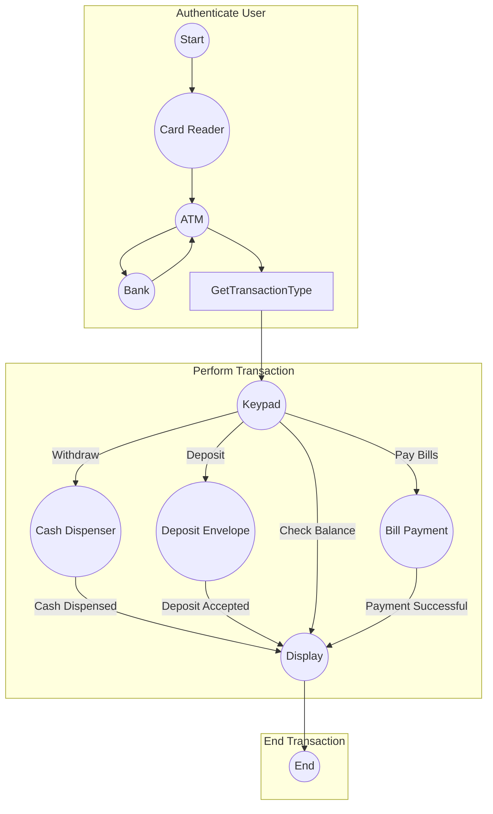

```mermaid
graph TD
  Start((Start))
  subgraph Authenticate User
    CardReader((Card Reader))
    ATM((ATM))
    Bank((Bank))
    
    Start --> CardReader
    CardReader --> ATM
    ATM --> Bank
    Bank --> ATM
    ATM --> GetTransactionType
  end
  
  subgraph Perform Transaction
    Keypad((Keypad))
    CashDispenser((Cash Dispenser))
    
    GetTransactionType --> Keypad
    Keypad --> |Withdraw|CashDispenser
    CashDispenser --> |Cash Dispensed|Display((Display))
    Keypad --> |Deposit|DepositEnvelope((Deposit Envelope))
    DepositEnvelope --> |Deposit Accepted|Display
    Keypad --> |Check Balance|Display
    Keypad --> |Pay Bills|BillPayment((Bill Payment))
    BillPayment --> |Payment Successful|Display
  end
  
  subgraph End Transaction
    End((End))
    
    Display --> End
  end
```