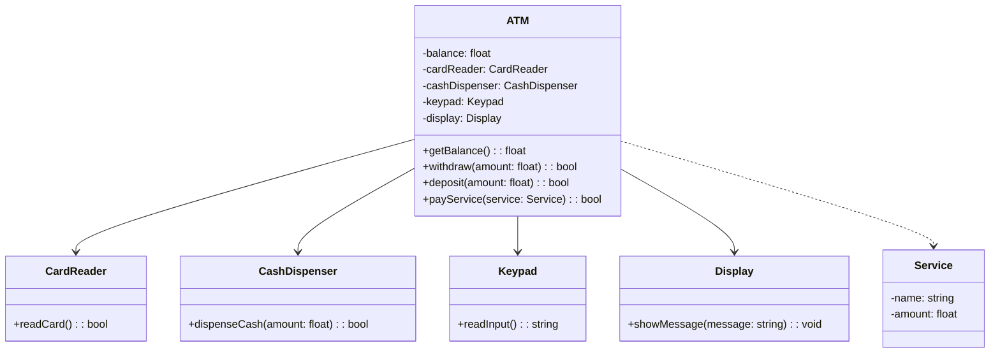

```mermaid
classDiagram
  class ATM {
    -balance: float
    -cardReader: CardReader
    -cashDispenser: CashDispenser
    -keypad: Keypad
    -display: Display
    +getBalance(): float
    +withdraw(amount: float): bool
    +deposit(amount: float): bool
    +payService(service: Service): bool
  }
  class CardReader {
    +readCard(): bool
  }
  class CashDispenser {
    +dispenseCash(amount: float): bool
  }
  class Keypad {
    +readInput(): string
  }
  class Display {
    +showMessage(message: string): void
  }
  class Service {
    -name: string
    -amount: float
  }
  
  ATM --> CardReader
  ATM --> CashDispenser
  ATM --> Keypad
  ATM --> Display
  ATM ..> Service
```