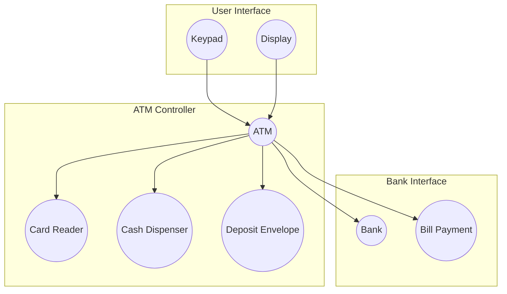

```mermaid
graph TD
  subgraph User Interface
    Keypad((Keypad))
    Display((Display))
  end
  
  subgraph ATM Controller
    ATM((ATM))
    CardReader((Card Reader))
    CashDispenser((Cash Dispenser))
    DepositEnvelope((Deposit Envelope))
  end
  
  subgraph Bank Interface
    Bank((Bank))
    BillPayment((Bill Payment))
  end
  
  Keypad --> ATM
  Display --> ATM
  ATM --> CardReader
  ATM --> CashDispenser
  ATM --> DepositEnvelope
  ATM --> Bank
  ATM --> BillPayment
```