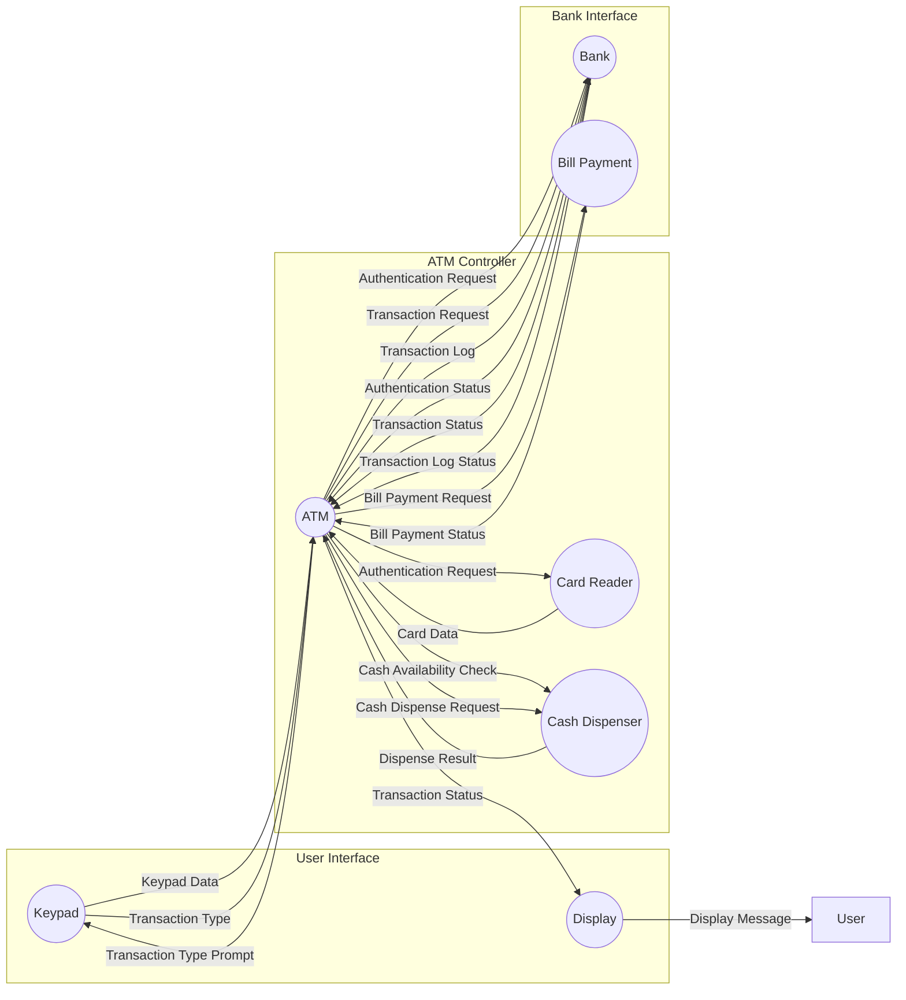

```mermaid
graph LR
  subgraph User Interface
    Keypad((Keypad))
    Display((Display))
  end
  
  subgraph ATM Controller
    ATM((ATM))
    CardReader((Card Reader))
    CashDispenser((Cash Dispenser))
  end
  
  subgraph Bank Interface
    Bank((Bank))
    BillPayment((Bill Payment))
  end
  
  Keypad -- Keypad Data --> ATM
  ATM -- Authentication Request --> CardReader
  CardReader -- Card Data --> ATM
  ATM -- Authentication Request --> Bank
  Bank -- Authentication Status --> ATM
  ATM -- Transaction Type Prompt --> Keypad
  Keypad -- Transaction Type --> ATM
  ATM -- Cash Availability Check --> CashDispenser
  ATM -- Transaction Request --> Bank
  Bank -- Transaction Status --> ATM
  ATM -- Transaction Status --> Display
  Display -- Display Message --> User
  ATM -- Cash Dispense Request --> CashDispenser
  CashDispenser -- Dispense Result --> ATM
  ATM -- Transaction Log --> Bank
  Bank -- Transaction Log Status --> ATM
  ATM -- Bill Payment Request --> BillPayment
  BillPayment -- Bill Payment Status --> ATM
```