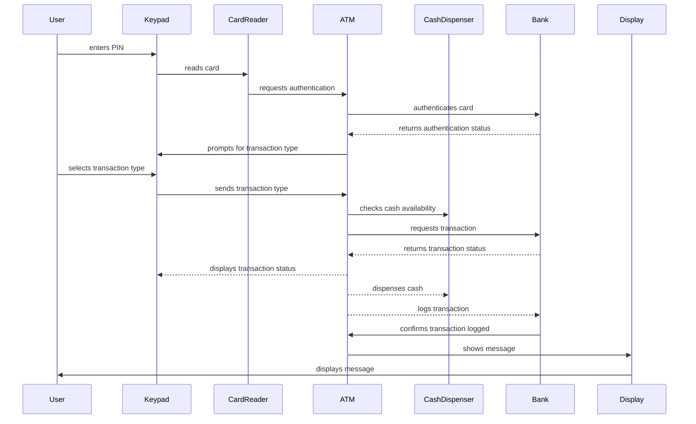

```mermaid
sequenceDiagram
  participant User
  participant Keypad
  participant CardReader
  participant ATM
  participant CashDispenser
  participant Bank
  
  User ->> Keypad: enters PIN
  Keypad ->> CardReader: reads card
  CardReader ->> ATM: requests authentication
  ATM ->> Bank: authenticates card
  Bank -->> ATM: returns authentication status
  ATM ->> Keypad: prompts for transaction type
  User ->> Keypad: selects transaction type
  Keypad ->> ATM: sends transaction type
  ATM ->> CashDispenser: checks cash availability
  ATM ->> Bank: requests transaction
  Bank -->> ATM: returns transaction status
  ATM -->> Keypad: displays transaction status
  ATM -->> CashDispenser: dispenses cash
  ATM -->> Bank: logs transaction
  Bank ->> ATM: confirms transaction logged
  ATM ->> Display: shows message
  Display ->> User: displays message
```